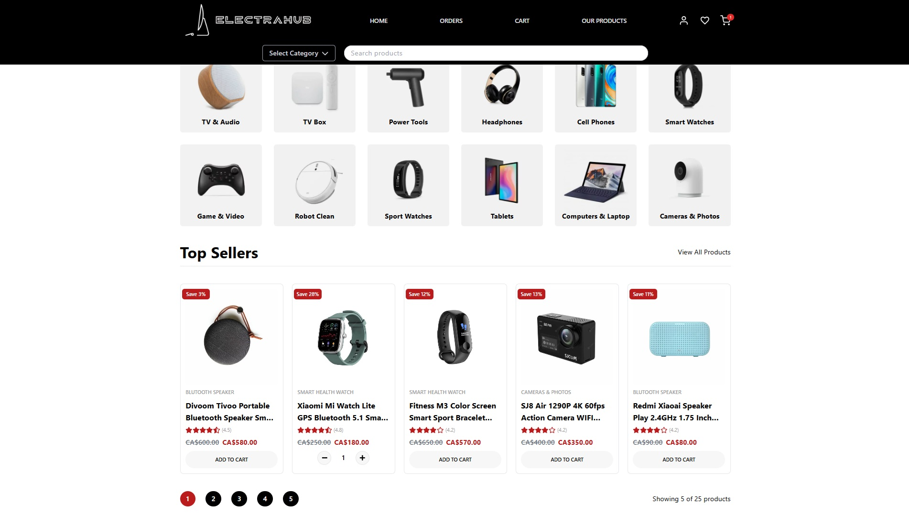
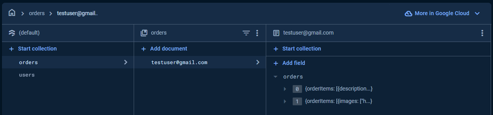
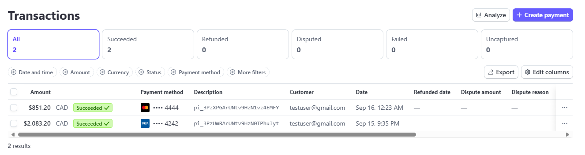

# ElectraHub

An E-commerce Website. Check it out [here](https://electra-hub-client.vercel.app/)!

### *Techstack: React (Typescript), Tailwind, NodeJS, Stripe.js, Firebase*
<!-- pnpm i tailwind-merge: Utility function to efficiently merge Tailwind CSS classes in JS without style conflicts. -->

## Using Firebase to manage users and their orders

## Using Stripe API as the payment method for the web app

## Lists of all node modules required:

For frontend (client folder)

- `react-router-dom`, `react-hot-toast`, `react-icons`, `react-loader-spinner`, `react-multi-carousel`, `react-paginate`, `tailwind`, `tailwind-merge`, `zustand`, `lodash`, `firebase`, `@stripe/stripe-js`, `@headlessui/react`

For backend (admin folder)

- `express`, `cors`, `nodemon`, `dotenv`, `stripe`

## Deployment
The backend of this project is deployed on Vercel, allowing easy access to data through a [JSON API endpoint](https://electra-hub-server.vercel.app/). You can access the backend by using the provided link, which serves the necessary data for the frontend.

To keep sensitive information secure, I imported .env files onto vercel to hide API keys for Firebase and Stripe.js. This ensures that credentials are not exposed in the codebase, enhancing the overall security of the application.

## Testing
### Account:

- email: `testuser@gmail.com`

- password: `test123456`

### Firebase:

You can create an account or use test-account to purchase products

#### Stripe:
Here's the list of card you can use to test the payment method

| Card Type                        | Card Number            | CVV          | Expiration Date     |
|----------------------------------|------------------------|--------------|---------------------|
| Visa                             | 4242 4242 4242 4242    | Any 3 digits | Any future date     |
| Visa (debit)                    | 4000 0566 5566 5556    | Any 3 digits | Any future date     |
| Mastercard                       | 5555 5555 5555 4444    | Any 3 digits | Any future date     |
| Mastercard (2-series)           | 2223 0031 2200 3222    | Any 3 digits | Any future date     |
| Mastercard (debit)              | 5200 8282 8282 8210    | Any 3 digits | Any future date     |
| Mastercard (prepaid)            | 5105 1051 0510 5100    | Any 3 digits | Any future date     |
| American Express                 | 3782 8224 6310 005     | Any 4 digits | Any future date     |
| American Express                 | 3714 4963 5398 431     | Any 4 digits | Any future date     |
| Discover                         | 6011 1111 1111 1117    | Any 3 digits | Any future date     |
| Discover                         | 6011 0009 9013 9424    | Any 3 digits | Any future date     |
| Discover (debit)                | 6011 9811 1111 1113    | Any 3 digits | Any future date     |
| Diners Club                     | 3056 9300 0902 0004    | Any 3 digits | Any future date     |
| Diners Club (14-digit card)     | 3622 7206 2716 67      | Any 3 digits | Any future date     |
| BCcard and DinaCard             | 6555 9000 0060 4105    | Any 3 digits | Any future date     |
| JCB                              | 3566 0020 2036 0505    | Any 3 digits | Any future date     |
| UnionPay                        | 6200 0000 0000 0005    | Any 3 digits | Any future date     |
| UnionPay (debit)               | 6200 0000 0000 0047    | Any 3 digits | Any future date     |
| UnionPay (19-digit card)       | 6205 5000 0000 0000 004| Any 3 digits | Any future date     |
